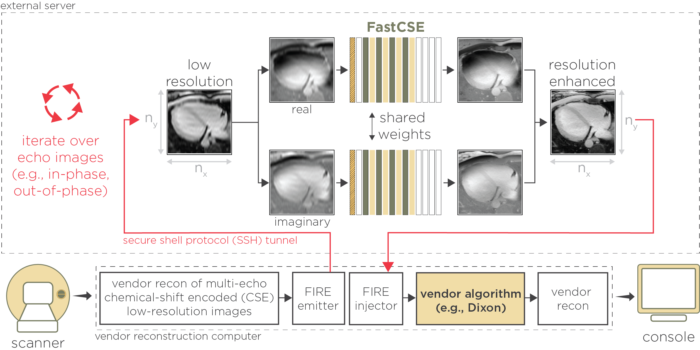

# FastCSE
Accelerated Chemical Shift Encoded Cardiac MRI with Use of Resolution Enhancement Network

[[Harvard Dataverse](https://dataverse.harvard.edu/dataset.xhtml?persistentId=doi:10.7910/DVN/FDAYBZ)]

 

# FastCSE

## Accelerated Chemical Shift Encoded Cardiac MRI with Use of Resolution Enhancement Network

We sought to develop a deep learning network (FastCSE) to accelerate CSE.

FastCSE was built on a super-resolution generative adversarial network ESRGAN extended to enhance complex-valued image sharpness. FastCSE enhances each echo image independently before water-fat separation. 

The trained weights for each of the networks can be downloaded through the [Harvard Dataverse](https://dataverse.harvard.edu/dataset.xhtml?persistentId=doi:10.7910/DVN/FDAYBZ).

    
     
    

    Multi-echo chemical shift encoded (CSE) images acquired with reduced phase encoding resolution are reconstructed using the standard vendor reconstruction pipeline. The multi-echo images are sent to an external server via a Framework for Image Reconstruction (FIRE) interface. Within the external server, FastCSE is applied to each echo image independently. Therefore, FastCSE readily reconstructs dual-echo or multi-echo images without any modifications. FastCSE uses a single generative network to enhance both the real and imaginary components of the echo image separately. Both components are combined during inference, allowing enhancement of complex-valued images. The enhanced images can be subsequently processed using a vendor algorithm. In the current implementation, we acquired low-resolution dual-echo in-phase and out-of-phase images. The images were reconstructed using a vendor Dixon algorithm, allowing reconstruction of resolution-enhanced fat and water images. 
	

      

